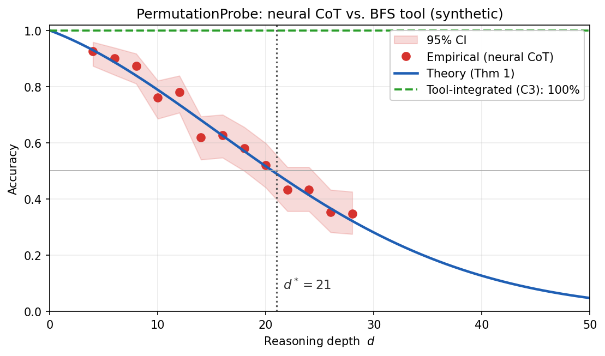

<div align="center">

# 🧭 The Deterministic Horizon

### When extended chain-of-thought stops helping — and tool delegation becomes *necessary*

*Official code for the ICML 2026 paper.*

[](paper/ICML2026_DeterministicHorizon_CameraReady.pdf)
[](LICENSE)
[](https://www.python.org/downloads/)
[](https://github.com/astral-sh/ruff)
[](tests/)
[](https://colab.research.google.com/github/bettyguo/deterministic-horizon/blob/main/notebooks/01_quickstart.ipynb)
[](https://bettyguo.github.io/deterministic-horizon/)

<br/>



<sub><b>The wall has a name.</b> Neural CoT accuracy follows the super-exponential decay of Theorem&nbsp;4.2 and crosses 50% at the <b>Deterministic Horizon</b> <i>d</i>*. Tool delegation (C3) ignores the wall. <i>This is the offline <b>synthetic</b> reproduction (regenerated live from <a href="results/sample/synthetic_results.json"><code>results/sample/</code></a> — no API keys); it mirrors the paper's Fig.&nbsp;1 on real GPT-4o, whose measured numbers (d*&nbsp;=&nbsp;22, tool&nbsp;≈&nbsp;90%) appear in the table below.</i></sub>

Interactive horizon visualiser — [live explorer](https://bettyguo.github.io/deterministic-horizon/) ([source](docs/index.html)) with model comparison, cost analysis, an agent decomposition planner, and a delegation quiz

</div>

---

## The 30-second pitch

We tested **12 frontier models** on **deterministic state-space search** — the kind of problem BFS solves in milliseconds. They all hit the same wall, at the same place:

| Model | Neural CoT (C1) | **Tool delegation (C3)** | Horizon *d*\* |
|---|---:|---:|---:|
| GPT-4o            | 28% | **90%** | 22 |
| Claude-4.5-Opus   | 35% | **94%** | 27 |
| o3-mini           | 42% | **94%** | 31 |
| DeepSeek-R1       | 40% | **93%** | 29 |

<sub>PermutationProbe, neural CoT vs. tool-integrated reasoning (paper Table&nbsp;3).</sub>

The wall sits at **d\* ∈ [19, 31] reasoning steps**. We give it a name (the **Deterministic Horizon**), derive it from the information-theoretic capacity of attention (Theorem&nbsp;4.2), and prove that **fine-tuning cannot push past it** (Theorem&nbsp;4.7).

<div align="center">

<br/>
<sub><b>Same wall, different distances.</b> Lower baseline error and longer effective decoherence length push the horizon out — but every model crosses below the tool baseline. Regenerate with <code>dh compare-figure</code>; explore it live in the <a href="https://bettyguo.github.io/deterministic-horizon/#compare">interactive comparison</a>.</sub>
</div>

> **Why care?** Every agentic system shipping today — code agents, browser agents, planners — must decide *when to think* and *when to call a tool*. Past d\*, "think harder" is a coin flip. Hand off.

---

## Five lines that ship to your agent today

```python
from deterministic_horizon import should_delegate

# In your planner loop:
if should_delegate(estimated_depth=subproblem_depth, model="claude-4.5-opus"):
    answer = call_tool(subproblem)        # BFS / search / SQL / verifier
else:
    answer = call_llm(subproblem)         # neural chain-of-thought
```

Need the full justification (for logging or eval)?

```python
>>> from deterministic_horizon import delegation_decision
>>> d = delegation_decision(estimated_depth=30, model="claude-4.5-opus")
>>> d.explain()
"At estimated depth d=30, model 'claude-4.5-opus' is expected to reach 45% via CoT
 vs. 92% via tools (horizon d*=27). → delegate."
```

The decision is the paper's Theorem&nbsp;4.2 decay model, `ε(d) = ε₀ + γ·d/L_eff`, evaluated per model. Per-model horizons, when this *doesn't* apply, and three production routing patterns: **[docs/when-to-delegate.md](docs/when-to-delegate.md)**.

---

## 60-second offline demo (no API keys)

```bash
git clone https://github.com/bettyguo/deterministic-horizon
cd deterministic-horizon
pip install -e .
python examples/demo.py            # estimates the horizon live, offline
python examples/agent_routing.py   # end-to-end routing pattern

# Or query the policy straight from the CLI — no API keys, no data:
dh delegate --depth 30 --model claude-4.5-opus   # → DELEGATE (47% CoT vs 92% tool)
dh horizons                                       # per-model d* / ε₀ / L_eff table
dh compare-figure                                 # render the per-model decay-curve figure
```

You'll watch the horizon estimated from a synthetic decoherence simulator (per-step error exactly `ε₀ + γ·d/L_eff`), a decoherence-model fit of **R² ≈ 0.95**, and a publication-grade figure written to `analysis/figure_decay.png` (the hero image above).

Want the **real LLMs**? Add API keys to `.env` (see [`.env.example`](.env.example)) and:

```bash
dh evaluate --model gpt-4o --instances data/sample/permutation_n8.json \
            --conditions C1,C3 --output results/gpt4o.json
dh analyze  --results results/gpt4o.json --output analysis/gpt4o/
```

---

## Headline findings (and how to reproduce them)

| Metric | Value | Why it matters |
|---|---|---|
| Deterministic Horizon $d^*$ | **19–31 steps** | Beyond this depth, neural CoT accuracy < 50%. |
| Tool-integrated accuracy | **86–94%** | Across 8 task domains and 12 models. |
| Neural CoT accuracy | **24–42%** | The same tasks, no tools. |
| Cross-model correlation $r$ | **0.81–0.91** | Models from 6 orgs fail on the *same* instances ⇒ architectural, not training-specific. |
| Fine-tuning recovery | **+3.2%** | Theorem 4.7 predicts < 5%; the competing theory predicts > 30%. |
| Cost efficiency (tool vs. CoT) | **4.2–4.7×** | Lower cost-per-correct-solution. |
| Decoherence-model fit | **R² = 0.96** | Super-exponential decay beats linear (0.71) and exponential (0.83). |

```bash
make paper-figures   # regenerate assets/figure_*.png  from results/sample/
make paper-tables    # regenerate analysis/*.{md,json} from results/sample/
```

Seeds (`{42, 2024, 2025}`), costs, and a wall-clock breakdown: **[docs/reproducing.md](docs/reproducing.md)**.

---

## Why this is different from "overthinking" papers

Prior work ([Wu et al., 2025](https://arxiv.org/abs/2503.16419)) attributes the inverted-U to a **Simplicity Bias** — a trained *preference* for short outputs, which fine-tuning should fix. We propose a **complementary architectural diagnosis**: even a model that *tries* to reason long *cannot* keep state, because causal attention lacks the substrate. The two theories make **four divergent, falsifiable predictions** — and the data backs the architectural one:

| | Simplicity Bias | **Decoherence (this work)** | Observed |
|---|---:|---:|---:|
| Fine-tune recovery | > 30% | **< 5%** | **3.2%** ✅ |
| Length-prompt gain | > 10% | **< 2%** | **0.9%** ✅ |
| Cross-model $r$ | low | **high** | **0.85** ✅ |
| Encoder-decoder advantage | none | **2–3×** | **2.8×** ✅ |

Plain-English walkthrough of each theorem: **[docs/theorem-cheatsheet.md](docs/theorem-cheatsheet.md)**.

---

## The theory in three equations

**Context-dependent per-step error** (Theorem 4.2) — error grows with *position* in the chain, not just task size:

$$\varepsilon(d) = \varepsilon_0 + \gamma\,\frac{d}{L_{\text{eff}}}\qquad\Longrightarrow\qquad P(\text{correct at depth }d) \approx \exp\!\Big(-d\varepsilon_0 - \tfrac{\gamma\,d(d+1)}{2L_{\text{eff}}}\Big)$$

Here $L_{\text{eff}}$ is the **effective decoherence length** — the number of steps over which attention keeps usable state resolution, empirically $O(10^2)$ steps, *not* the raw context window $O(10^5)$ tokens.

**Attention Bottleneck** (Theorem 4.4, with a complementary achievability construction) — capacity is bounded by the architecture:

$$|\mathcal{S}_{\text{track}}| \le c(\delta,\rho_{\max})\cdot 2^{\,H\,\log_2(L/H)\,\sqrt{d_h}}$$

**Deterministic Horizon** (Theorem 4.5) — solving $P(\text{correct}) = \alpha$ gives a closed form; for GPT-4o ($\varepsilon_0=0.02,\gamma=0.15,L_{\text{eff}}=150,\alpha=0.5$) it yields $d^* \approx 22.3$:

$$d^* = \frac{-\varepsilon_0 L_{\text{eff}} + \sqrt{\varepsilon_0^2 L_{\text{eff}}^2 + 2\gamma L_{\text{eff}}\ln(1/\alpha)}}{\gamma}$$

A fourth result (Theorem 4.7) bounds fine-tuning recovery by $O(d^*/d)$ — the architectural ceiling. Proofs are in the appendix; the formulas live in [`policy.py`](src/policy.py) and [`metrics/statistics.py`](src/metrics/statistics.py).

---

## Python API

```python
from deterministic_horizon import (
    PermutationTask, generate_instances, evaluate,
    estimate_horizon, fit_decoherence_model,
    should_delegate, should_delegate_batch, delegation_decision,
    horizon_table, recommend_model,
)

# 1. Generate BFS-optimal-depth instances (depth == true BFS optimum)
task = PermutationTask(n_elements=8, seed=42)          # S_8, diameter C(8,2)=28
instances = task.generate_instances(n_instances=400, min_depth=4, max_depth=28)

# 2. Evaluate a model (needs an API key in .env)
results = evaluate(model="gpt-4o", instances=instances, conditions=["C1", "C3"])

# 3. Estimate the horizon (super-exponential fit of Theorem 4.2)
horizon = estimate_horizon(results, threshold=0.5)
print(f"d* = {horizon['d_star']:.1f}  (R² = {horizon['r_squared']:.3f})")

# 4. Route in your own agent
should_delegate(estimated_depth=horizon['d_star'] + 5, model="gpt-4o")   # → True

# 5. Plan a whole decomposition at once, or pick the right model for a depth
should_delegate_batch([5, 8, 35], model="gpt-4o")   # → [False, False, True]
recommend_model(estimated_depth=18)                  # → least over-powered model that still clears 50%
horizon_table()                                       # → per-model d* / ε₀ / L_eff rows (sorted) — the source for `dh horizons`
```

### The five experimental conditions

| Condition | Description |
|---|---|
| **C1** | Neural chain-of-thought (standard prompting) |
| **C2** | Depth-limited CoT (oracle optimal length) |
| **C3** | Tool-integrated (BFS / verifier access) |
| **C4** | Length-encouraged prompting ("take as many steps as needed") |
| **C5** | Fine-tuned on optimal-length traces |

---

## What's inside

```
deterministic-horizon/
├── src/
│   ├── policy.py        # should_delegate / delegation_decision  ← the engineering hook
│   ├── tasks/           # PermutationProbe, FSA-Sim, ArithChain (+ BFS oracle)
│   ├── models/          # Uniform interface: OpenAI / Anthropic / DeepSeek / Gemini / Together / local
│   ├── metrics/         # SSJ, SFE, super-exponential horizon fit, bootstrap CIs
│   ├── analysis.py      # Figures + tables (+ plot_model_horizons comparison)
│   ├── runners.py       # High-level evaluate(...) Python API
│   └── cli.py           # dh generate | evaluate | analyze | delegate | horizons | compare-figure
├── examples/            # demo.py (offline horizon) · agent_routing.py
├── notebooks/           # 01_quickstart.ipynb (Colab-friendly)
├── docs/                # When-to-delegate · Theorem cheat-sheet · Reproducing · FAQ
├── scripts/             # regenerate_sample_data.py (deterministic artifacts)
├── data/sample/         # BFS-optimal PermutationProbe instances (n=8)
├── results/sample/      # Pre-computed synthetic C1/C3 results
├── configs/             # OmegaConf configs (model × task × experiment)
├── paper/               # ICML 2026 camera-ready (LaTeX + PDF)
└── tests/               # pytest suite (smoke · metrics · tasks · policy · analysis)
```

---

## Installation

```bash
pip install -e .                      # slim: core metrics + analysis, no LLM clients
pip install -e ".[openai,anthropic]"  # + API clients
pip install -e ".[local]"             # + PyTorch / transformers / peft (open-weight + C5)
pip install -e ".[all,dev]"           # everything + test/lint tooling
```

Requires Python 3.10–3.13. CI runs the suite on Linux, macOS, and Windows.

---

## FAQ (highlights)

<details>
<summary><b>Is the offline demo cherry-picked?</b></summary>

No. The demo uses a *synthetic* reasoner whose per-step error follows the exact context-dependent model of Theorem 4.2. It's a controlled illustration; the cross-model empirical numbers come from real API calls — 12 models × 5 conditions × 8 tasks × 500 instances × 3 seeds = 720,000 evaluations, ~$3,420 in API cost.
</details>

<details>
<summary><b>How is this different from "transformers can't do X" papers?</b></summary>

Expressivity work proves what transformers *cannot compute in principle* (asymptotic $\text{TC}^0$ statements). We characterise what frontier models *cannot reliably execute in practice* at the depths real systems run at, give a closed-form bound, and prove fine-tuning cannot move it. The Deterministic Horizon is a usable engineering quantity (~22 steps), not an asymptotic.
</details>

<details>
<summary><b>Does this mean reasoning models are useless?</b></summary>

The opposite — it tells you exactly *when* to use them and *when* to delegate. Below d\* extended reasoning helps; past d\* it degrades and tools win by 50–70 points. The contribution is knowing the boundary.
</details>

Full FAQ: **[docs/faq.md](docs/faq.md)**.

---

## Citation

```bibtex
@inproceedings{guo2026deterministic,
  author    = {Guo, Dongxin and Wu, Jikun and Yiu, Siu Ming},
  title     = {The Deterministic Horizon: When Extended Reasoning Fails and Tool Delegation Becomes Necessary},
  booktitle = {Proceedings of the 43rd International Conference on Machine Learning (ICML)},
  year      = {2026},
}
```

A [`CITATION.cff`](CITATION.cff) is included, so GitHub's "Cite this repository" button works out of the box.

---

## Contributing

Bug reports, new tasks, and extensions are welcome. See [`CONTRIBUTING.md`](CONTRIBUTING.md); issue templates and a PR checklist are wired up under [`.github/`](.github/). Research directions (help wanted):

- [ ] SWE-Bench-State / WebArena-Nav / SQL-Multi adapters
- [x] Gemini and Together adapters — OpenAI-compatible, in [`src/models/`](src/models/)
- [ ] Mamba / RWKV / MoE decoherence study
- [x] Interactive horizon visualiser — [live explorer](https://bettyguo.github.io/deterministic-horizon/) ([source](docs/index.html)) with model comparison, cost analysis, an agent decomposition planner, and a delegation quiz

---

<div align="center">

**The Deterministic Horizon isn't a soft suggestion — it's a wall.**
If your next subproblem is ≳ 20 deterministic state-tracking steps, delegate.

[Paper](paper/ICML2026_DeterministicHorizon_CameraReady.pdf) · [Docs](docs/README.md) · [When to delegate](docs/when-to-delegate.md) · [Interactive explorer](https://bettyguo.github.io/deterministic-horizon/) · [Quickstart notebook](notebooks/01_quickstart.ipynb) · [Issues](https://github.com/bettyguo/deterministic-horizon/issues)

</div>

